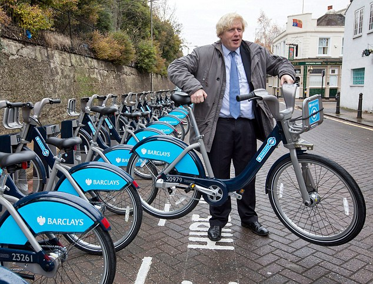

### [Makers Academy](http://www.makersacademy.com) - Week 1 Pair Programming Project

# Boris-bikes 🚲
[Outline](#Outline) | [Task](#Task) | [Installation Instructions](#Installation) | [Functional Description](#Functional_Description) | [Feature Tests](#Feature_Tests) | [User Stories](#Story) | [Objects & Methods](#Methods) | [Testing](#Testing) | [Further improvements](#Further_Improvements)



## <a name="Outline">Outline</a>

Let's go back several years, to the days when there were no Boris Bikes. Transport for London, the body responsible for delivery of a new bike system, come to you with a plan: a network of docking stations and bikes that anyone can use. They want you to build a program that will emulate all the docking stations, bikes, and infrastructure (repair staff, and so on) required to make their dream a reality.

This challenge is the first afternoon challenge at [Makers Academy](https://github.com/makersacademy).

## <a name="Task">The Task</a>
This project is based on the `User Stories` listed below. Each `User Story` has been further broken down into `Objects` and `Methods`. Tests have been designed for all features in line with TDD best-practice.

## <a name="Installation">Installation Instructions</a>

1. Fork this repository, clone to your local machine then change into the directory:
```
$ git clone https://github.com/davmcgregor/boris-bikes.git 
$ cd boris-bikes
```
2. Load dependencies with bundle:
```
$ gem install bundle
$ bundle
```
3. Run the app in the terminal:

```Shell
$ irb
> require './lib/boris_bikes.rb'
```
## <a name="Functional_Description">Functional Description</a>
The system's functionality includes:
* A __bike__ can be docked or relased from a __docking station__. 
* If a __bike__ is reported __broken__ then that __bike__
  cannot be relased from a __docking station__ (it can still be returned to a).
* __Garages__ fix __broken bikes__.
* __Vans__ move __bikes__ between __docking stations__ and __garages__.

## <a name="Feature_Tests">Feature Tests (How it works)</a>
```
 > station = DockingStation.new
 > bike = Bike.new
```
To report a bike as broken, use .report_broken
```
> bike.report_broken
> bike.broken?
 => true
 ```

To dock a bike at a docking station, use .dock on the station and pass bike as an argument. An array of bikes inside the docking station can be access with .bikes. Docking will fail is the station is at capacity.,

```
> station.dock(bike)
> station.bikes
=> [#<Bike:0x007fea65216040 @broken=false>] 
```

## <a name="Story">User Stories</a>

```
As a person,
So that I can use a bike,
I'd like a docking station to release a bike.
```
```
As a person,
So that I can use a good bike,
I'd like to see if a bike is working
```
```
As a member of the public
So I can return bikes I've hired
I want to dock my bike at the docking station
```
```
As a member of the public
So I can decide whether to use the docking station
I want to see a bike that has been docked
```
```
As a maintainer of the system,
So that I can control the distribution of bikes,
I'd like docking stations not to accept more bikes than their capacity.
```
```
As a system maintainer,
So that I can plan the distribution of bikes,
I want a docking station to have a default capacity of 20 bikes.
```
```
As a system maintainer,
So that busy areas can be served more effectively,
I want to be able to specify a larger capacity when necessary.
```
```
As a member of the public,
So that I reduce the chance of getting a broken bike in future,
I'd like to report a bike as broken when I return it.
```
```
As a maintainer of the system,
So that I can manage broken bikes and not disappoint users,
I'd like docking stations not to release broken bikes.
```
```
As a maintainer of the system,
So that I can manage broken bikes and not disappoint users,
I'd like docking stations to accept returning bikes (broken or not).
```
```
As a maintainer of the system,
So that I can manage broken bikes and not disappoint users,
I'd like vans to take broken bikes from docking stations and deliver them to garages to be fixed.
```
```
As a maintainer of the system,
So that I can manage broken bikes and not disappoint users,
I'd like vans to collect working bikes from garages and distribute them to docking stations.
```
## <a name="Methods">Objects & Methods</a>

For the user stories I created a domain model for each object, including attributes and behaviour:

| Object: | DockingStation | | | |
| ------- | ------- | - | - | - |
| **Attributes:** | bikes | capacity |
| **Methods:** | release_bike | dock(bike) | full? | empty? | remove_bikes |
<br/>
| Object: | Bike | | | 
| ------- | ----- | - | - | 
| **Attributes:** | broken |
| **Methods:** | broken? | report_broken | fix |
<br/>
| Object: | Van | |
| ------- | ----- | - |
| **Attributes:** | van_bikes |
| **Methods:** | get_bikes(station | empty_van | distribute_bikes(station) |
<br/>
| Object: | Garage | |
| ------- | ----- | - |
| **Attributes:** | garage_bikes |
| **Methods:** | deliver_bikes(van) | empty_garage | fix_bikes | return_fixed_bikes |

## <a name="Testing">Testing</a>

Tests were written with RSpec. To run the tests in terminal: 

```bash
$> cd boris-bikes
$> rspec
```

## <a name="Further_Improvements">Further Improvements</a>
* Complete [Step 22: Modules as mixins](https://github.com/davmcgregor/course/blob/master/boris_bikes/22_modules_as_mixins.md)
* Complete [Post challenge](https://github.com/davmcgregor/course/blob/master/boris_bikes/post_challenge.md) extensions
* Refactor Garage and Van classes
* Update README to include Garage and Van functionality
